<div align="center">

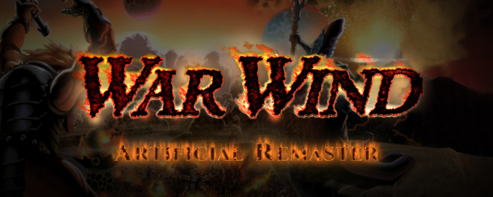

<h3>DreamForge's 1997 RTS, rebuilt for today's screens</h3>

<p>
Widescreen, 60 fps, AI-upscaled cutscenes and a modern lighting pass.<br>
The original game runs underneath, untouched.
</p>

<p>


<br>


</p>

<p>
<a href="AI-DECLARATION.md"></a>
<a href="https://buymeacoffee.com/jlrouzies"></a>
<a href="https://ko-fi.com/Y8Y61C8124"></a>
</p>

</div>

---

## ✦ &nbsp;Contents

- [**What changes**](#what-changes): the whole mod on one page
- [**Before / after**](#before-after): menus, missions, the pause menu, cutscenes
- [**Modern Graphics**](#modern-graphics): shadows, light, water, fog
- [**Install**](#install): one PowerShell script
- [**Known issues**](#known-issues): read this before you play
- [**Credits**](#credits)
- [**Technical reference**](docs/TECHNICAL.md): every setting, how it works, how to build it

<br>

<a id="what-changes"></a>
## ✦ &nbsp;What changes

| | |
|---|---|
| **Widescreen missions** | 1280x720, scaled to 4K. The map fills the width, over a new bottom HUD in your race's colours. |
| **New HUD** | Unit faces with health bars, control group plates, and a 5x3 command grid with hotkeys. |
| **Smooth everything** | 60 fps camera and unit motion, and pixel-precise scrolling with the mouse wheel, middle-drag and screen edges. |
| **Modern controls** | Right click orders, left click selects, Ctrl+digit control groups, double-click selects a unit type, grid hotkeys (QWERT…). |
| **Widescreen menus** | Main menu, race options, briefing, victory/defeat and the ESC menu, redrawn for 16:9 from the game's own art. |
| **HD cutscenes** | All 63 videos AI-upscaled from 320x240 at 15 fps to 1080p at 30 fps, with optional burned-in captions. |
| **Modern Graphics** | Soft shadows, contact shading, fire and magic lights, animated water, soft fog of war. F9 turns it on and off. |
| **In-game save / load** | A save screen in the game's style instead of the Windows file dialogs. |
| **Steady game clock** | The game runs at its designed pace instead of stuttering on modern Windows. |
| **Fixes** | Broken colours after dialogs, and three crashes. |

Every feature has a switch in `WarWindHD.ini`.

<br>

<a id="before-after"></a>
## ✦ &nbsp;Before / after

<table>
<tr><th width="50%">Original</th><th width="50%">Artificial Remaster</th></tr>
<tr>
  <td>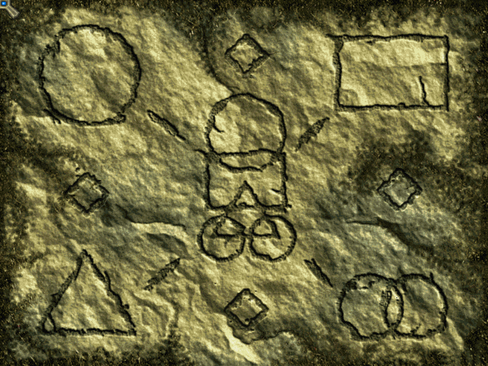</td>
  <td>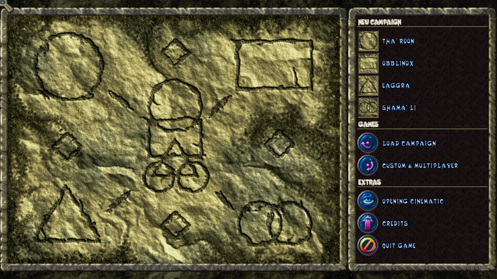</td>
</tr>
<tr><td colspan="2" align="center"><sub><b>Main menu.</b> The stone tablet stays; every glyph gets a labelled row beside it.</sub></td></tr>
<tr>
  <td>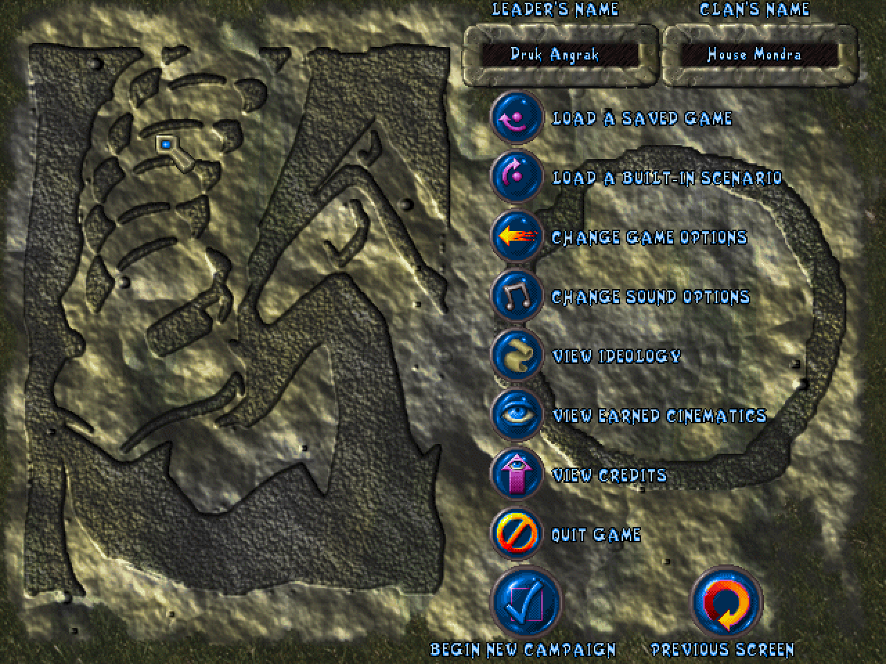</td>
  <td>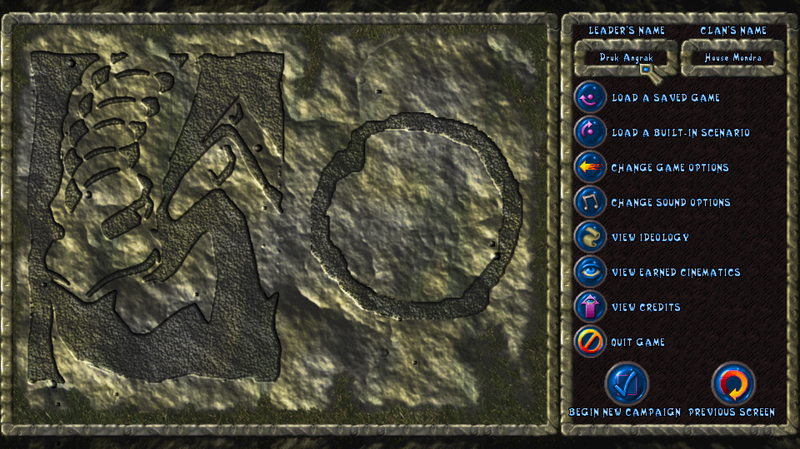</td>
</tr>
<tr><td colspan="2" align="center"><sub><b>Race options.</b> The race stone shown whole, the buttons on a carved panel.</sub></td></tr>
<tr>
  <td>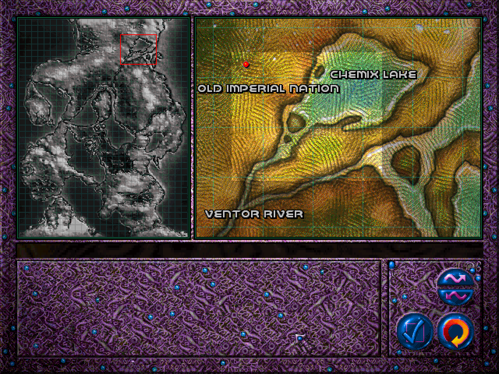</td>
  <td>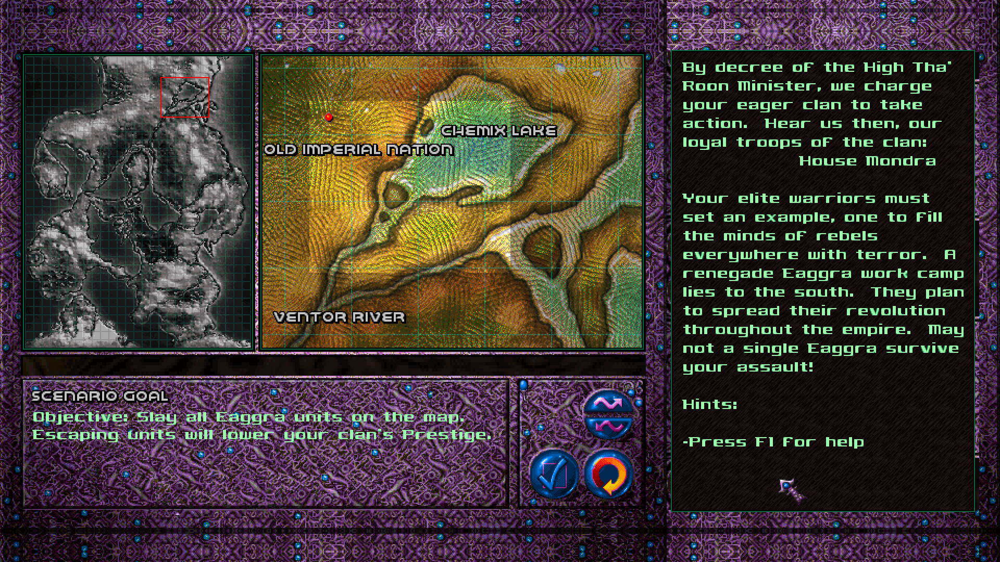</td>
</tr>
<tr><td colspan="2" align="center"><sub><b>Briefing.</b> Map, full text and the scenario goal on one screen.</sub></td></tr>
<tr>
  <td>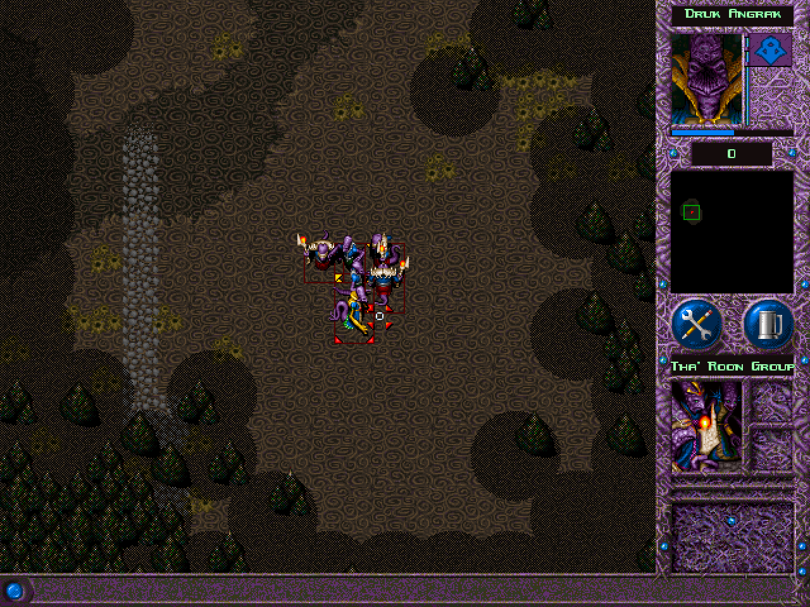</td>
  <td>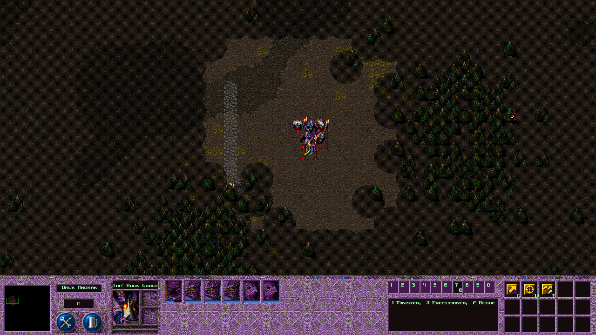</td>
</tr>
<tr><td colspan="2" align="center"><sub><b>Missions.</b> The full-width map and the new bottom HUD.</sub></td></tr>
<tr>
  <td>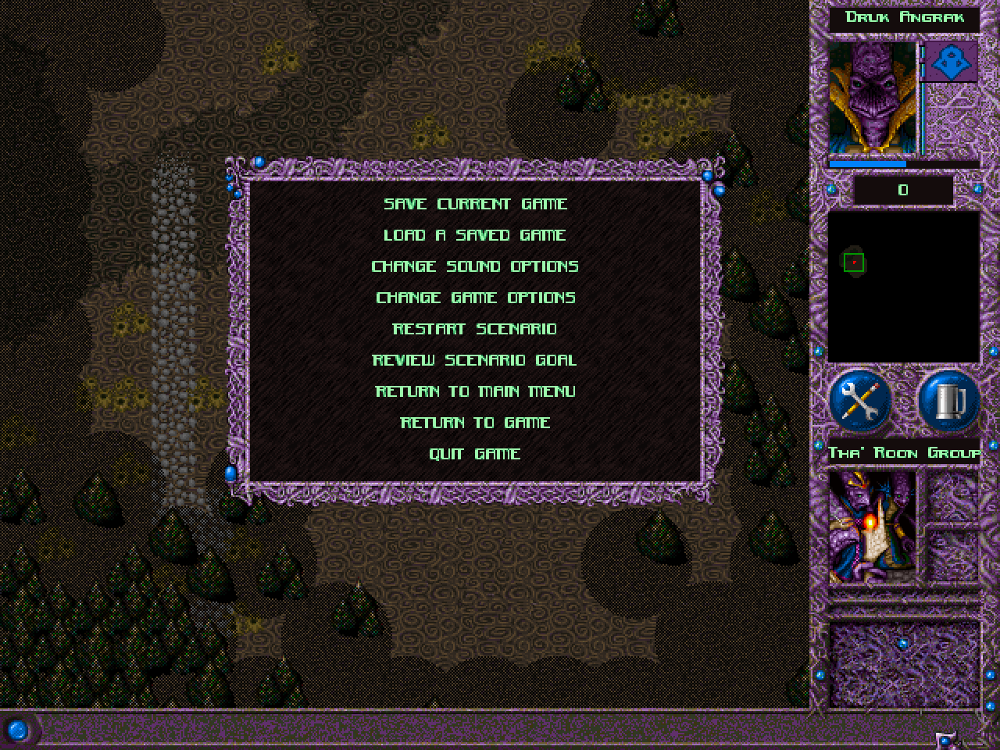</td>
  <td>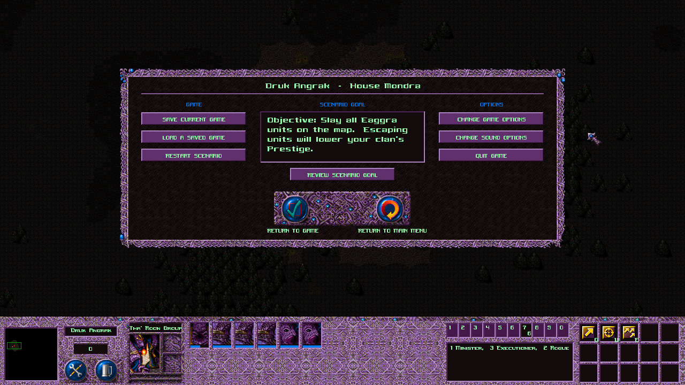</td>
</tr>
<tr><td colspan="2" align="center"><sub><b>ESC menu.</b> One wide panel over the dimmed map, with the scenario goal.</sub></td></tr>
<tr>
  <td>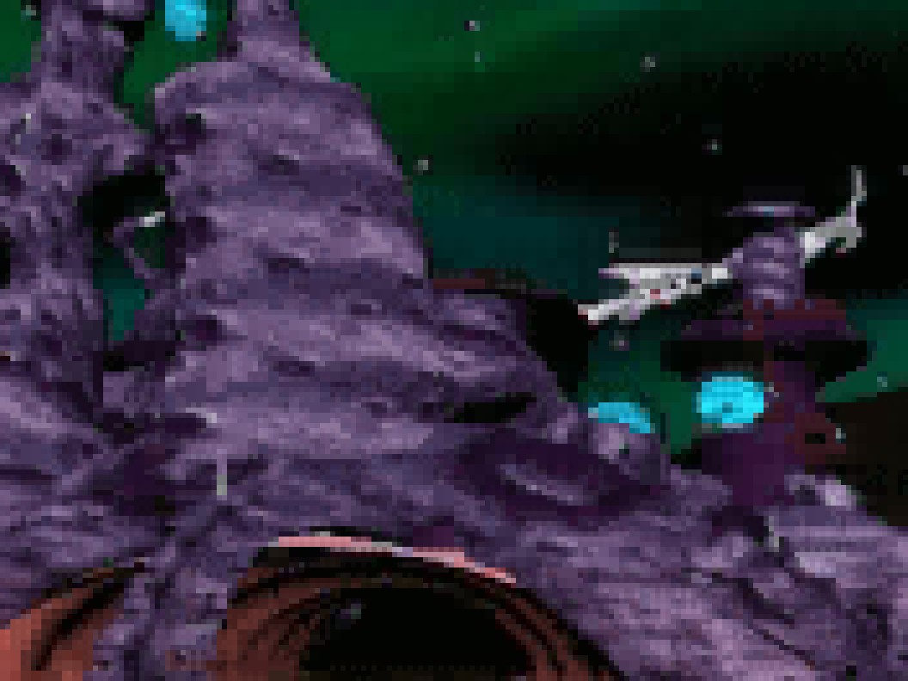</td>
  <td>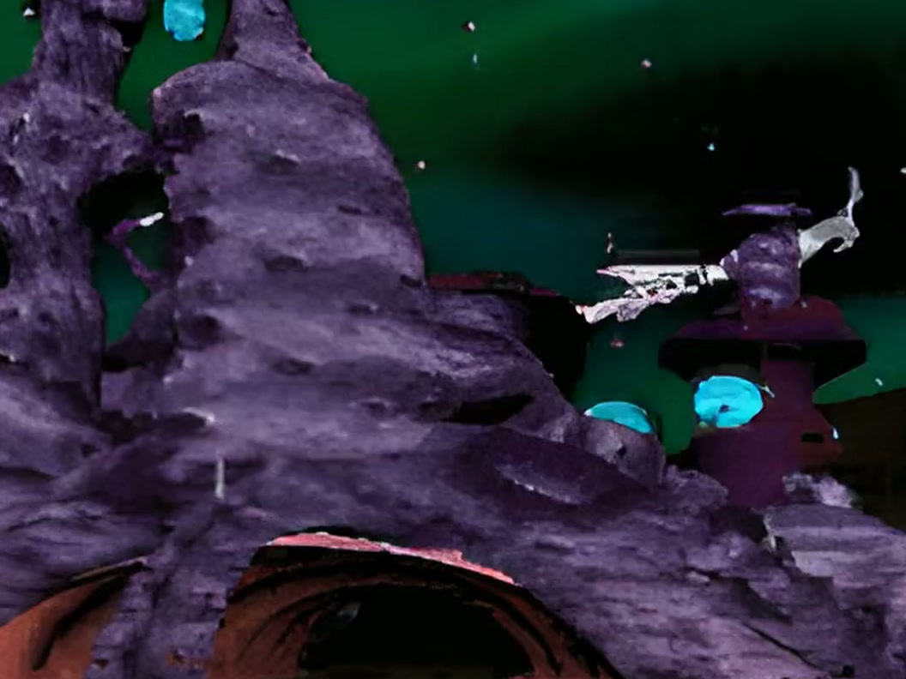</td>
</tr>
<tr><td colspan="2" align="center"><sub><b>Cutscenes.</b> A detail of the opening cinematic: 320x240 → 1080p.</sub></td></tr>
</table>

<br>

<a id="modern-graphics"></a>
## ✦ &nbsp;Modern Graphics

An optional lighting pass on top of the original art, in the spirit of the
*Definitive Editions*. The sprites are unchanged: the mod tells the renderer what each pixel
is (ground, unit, building, tree, fog), and the shaders do the rest.

<table>
<tr><th width="50%">Off</th><th width="50%">On</th></tr>
<tr>
  <td>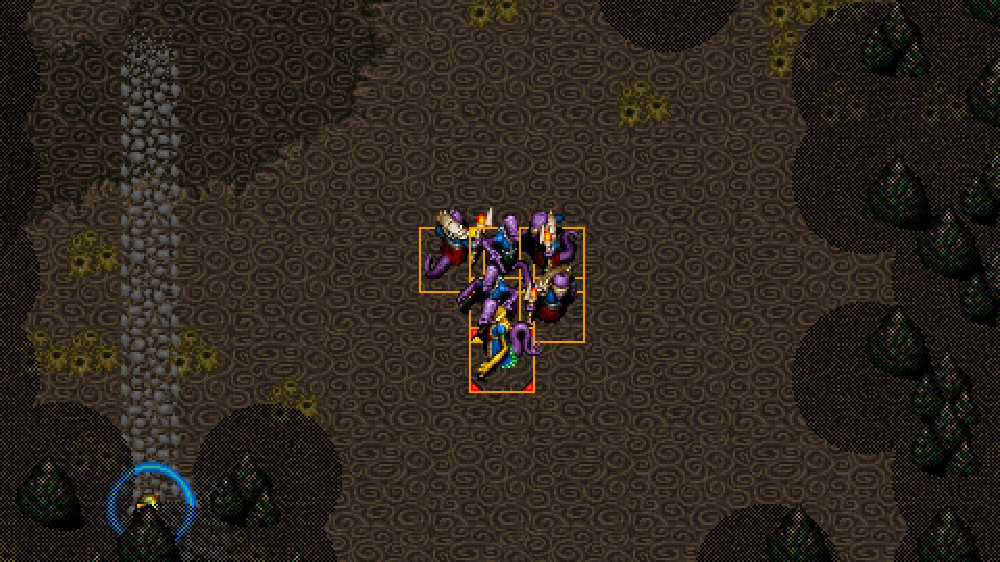</td>
  <td>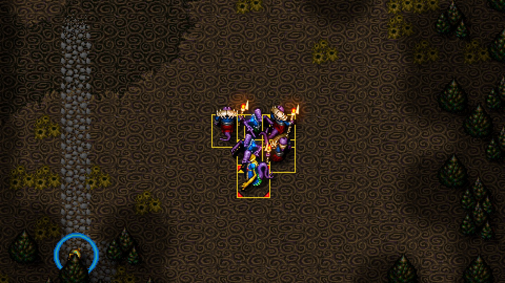</td>
</tr>
<tr><td colspan="2" align="center"><sub>Smooth shadows instead of checkerboards, torchlight, a soft fog of war.</sub></td></tr>
</table>

<div align="center">
<table width="50%">
<tr><th>Animated water</th></tr>
<tr><td>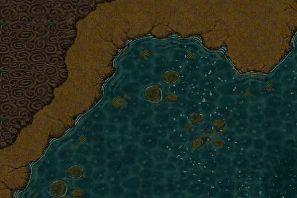</td></tr>
<tr><td align="center"><sub>Waves, caustics, sun glints and foam along the shore.</sub></td></tr>
</table>
</div>

<br>

- **Shadows.** The art's checkerboard shadows become smooth ones, and units get a soft drop shadow.
- **Contact shading.** Buildings, trees and units sit in the ground instead of on it.
- **Light.** Fire, explosions and magic glow and light what is around them, with a flicker.
- **Water.** Waves anchored to the map, caustics, glints and shore foam.
- **Fog of war.** A smooth gradient instead of a dither.
- **Colour grade.** A touch of contrast, saturation, sharpening and vignette.

Switch it with **F9**, or with **Change Game Options › Modern Graphics**. Every effect has a
strength in `[Graphics]`. It needs cnc-ddraw's Direct3D 9 renderer, the default. On other
renderers the game simply looks as before.

<br>

<a id="install"></a>
## ✦ &nbsp;Install

> [!NOTE]
> **You need your own copy of War Wind** ([Steam, app 1741140](https://store.steampowered.com/app/1741140/)).
> No game files are included here, and the mod never modifies `WW.EXE` on disk. The only game
> art in this repository is in the screenshots above, the banner and the AI-upscaled menu
> backdrop.

1. Download `Install-WarWindRemaster.ps1` from the [latest release](https://github.com/jlrouzies-fr/WarWind-ArtificialRemaster/releases).
2. Run it:

   ```powershell
   powershell -ExecutionPolicy Bypass -File .\Install-WarWindRemaster.ps1
   ```

It finds the game through Steam and backs up every file it replaces. It installs the mod and
the cnc-ddraw renderer, then downloads the HD cutscenes (about 740 MB, resumable).
`-SkipCutscenes` leaves the cutscenes out, and `-Uninstall` puts everything back.

All switches: [technical reference › Installer](docs/TECHNICAL.md#installer).

<br>

<a id="known-issues"></a>
## ✦ &nbsp;Known issues

This is a beta.

- The lines the game prints at the top left of the map fall outside the 1280x720 view.
- Some wide menu pages have not been play-tested yet: the Hall of Heroes, the victory picture,
  and the sound and ideology dialogs.
- On displays that are not a multiple of 960x540 (1440p, for example), the menus are scaled by
  the largest whole factor, on the stone backdrop.
- Water in unexplored areas stays still. The game draws unexplored ground in grey, so there
  is no water to animate until you have explored it.

Bug reports are welcome.

<br>

<a id="credits"></a>
## ✦ &nbsp;Credits

- **War Wind** © 1996–1997 DreamForge Intertainment / SSI. This is an unofficial fan project,
  not affiliated with or endorsed by the rights holders.
- [**cnc-ddraw**](https://github.com/FunkyFr3sh/cnc-ddraw) by FunkyFr3sh (MIT), with this
  project's patches in [`third_party/cnc-ddraw/`](third_party/cnc-ddraw/).
- [**Real-ESRGAN**](https://github.com/xinntao/Real-ESRGAN) (BSD-3-Clause) and
  [**RIFE**](https://github.com/hzwer/ECCV2022-RIFE) (MIT) for the cutscenes, through
  the ncnn-vulkan ports by nihui; [**FFmpeg**](https://ffmpeg.org).
- Banner: the original War Wind logo and key art (© DreamForge / SSI), with the subtitle set
  in [Cinzel](https://fonts.google.com/specimen/Cinzel) (OFL).

## ✦ &nbsp;Licence

The mod's code, patch sets, installer, shaders, tools and documentation are under the
[MIT licence](LICENSE). The cnc-ddraw patches follow cnc-ddraw's own MIT licence.

**War Wind's own art, music, sound, video and text are not covered, and cannot be licensed
here.** They belong to their rights holders. The upscaled backdrop, the upscaled cutscenes, the
screenshots of the original game and the banner are derived from them and stay subject to those
rights. They are provided only for use with a legitimately owned copy of the game, which is
required.
